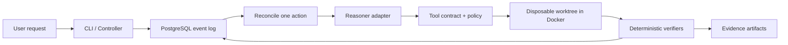

# AgentDock Verify

AgentDock Verify is a managed runtime for Eino-based coding agents that is designed to make execution recoverable, sandboxed, deterministic to verify, and replayable.

The five-week MVP is an engineering demonstration, not a claim of production-scale multi-tenancy or a strong security boundary. The repository is currently at **phase 0: repository bootstrap and architecture freeze**. There is no runtime, controller, worker, sandbox, agent, verifier, or CLI implementation yet.

The project contract and sole construction plan is [`AgentDock-Verify-施工计划.md`](AgentDock-Verify-施工计划.md). The frozen five-week scope is restated in [`docs/scope.md`](docs/scope.md).

## Why this exists

An agent saying that work is complete is not evidence that it is correct. AgentDock Verify will place a thin workflow around a durable runtime, isolated tools, deterministic verifiers, bounded repair, and replayable evidence:



Phase 1 defines a minimal framework-neutral Reasoner seam and `FakeReasoner`; Controller depends only on that seam. Phase 5 adds `EinoReasoner`, `ReplayReasoner`, and streaming/tool/usage/finish/error normalization behind it, while revalidating Fake compatibility. Eino types never cross into Controller. AgentDock owns lifecycle, persistence, leases and fencing, sandbox policy, verification, artifacts, fault injection, telemetry, and replay.

## Phase 0 check

Prerequisites:

- a Go installation capable of automatic toolchain selection;
- Docker with a running daemon;
- Docker Compose;
- local ports `5432`, `4317`, `4318`, and `16686` available.

Run:

```bash
make doctor
go mod verify
git diff --check
```

`make doctor` validates the pinned Go toolchain, Docker daemon, Compose, ports, required example parameters, YAML syntax, and the Compose model. It neither starts services nor writes a real `.env`.

The sample values in `.env.example` are local-only defaults, not production credentials. Live model credentials are not required in phase 0 and will never be a default CI dependency.

## Consistency and security claims

The planned execution model is at-least-once with idempotent scoped actions and fencing tokens. It will not be described as exactly-once.

Docker reduces accidental and common hostile access, but a container shares the host kernel and is not a strong multi-tenant isolation boundary. The MVP must run untrusted code only on a dedicated development machine or disposable runner appropriate for the risk.

See:

- [`docs/architecture.md`](docs/architecture.md)
- [`docs/state-machine.md`](docs/state-machine.md)
- [`docs/event-model.md`](docs/event-model.md)
- [`docs/threat-model.md`](docs/threat-model.md)
- [`docs/harness-spec.md`](docs/harness-spec.md)
- [`docs/adr/`](docs/adr/)

## License

Apache License 2.0. See [`LICENSE`](LICENSE).
