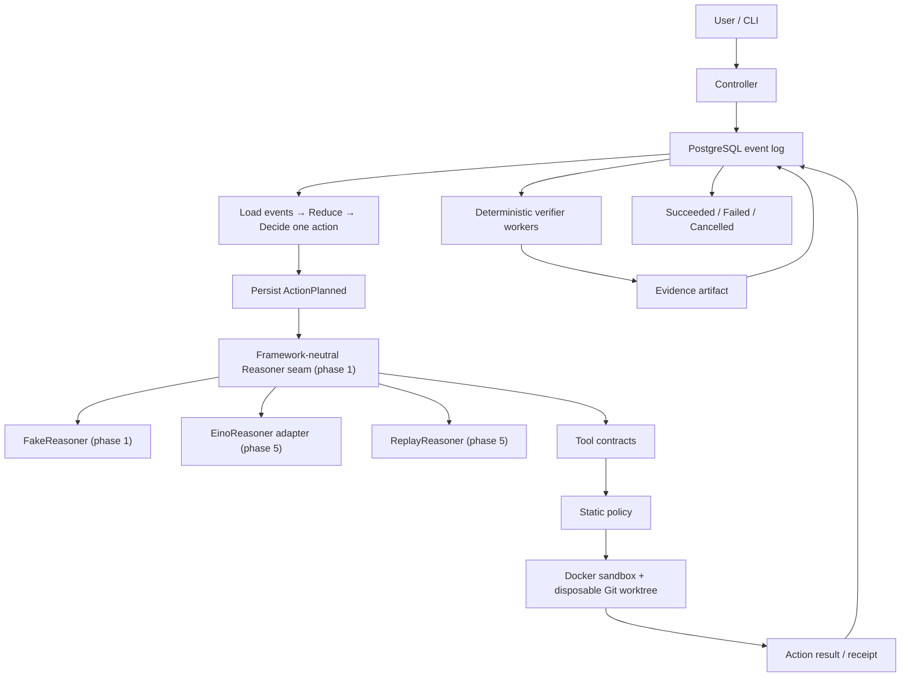

# Architecture

## Position and boundary

AgentDock Verify is a managed runtime around an Eino coding agent. Its workflow stays deliberately small:

```text
Prepare → Reason → Act → Verify → Repair → Verify → Complete
```

The project differentiates itself through durable state, crash recovery, concurrency control, isolated execution, deterministic verification, replay, and evidence—not through a general workflow engine.

This contract was frozen in phase 0. Phase 2 implements the domain reducer/decider, framework-neutral Reasoner seam and FakeReasoner, compatible memory and PostgreSQL Event Stores, transactional Run-version CAS, verified checkpoints, Artifact registration, one Reconcile path, and a PostgreSQL-backed restartable CLI. Other components shown below remain planned for their assigned phases.

## Request-to-artifact path



The end-to-end path is:

1. The CLI submits a `HarnessRun` request.
2. The controller appends `RunCreated`; it does not make an in-memory object authoritative.
3. A worker acquires a lease and a monotonically increasing fencing token.
4. Reconcile loads events, reduces state, and decides at most one action.
5. The worker appends `ActionPlanned` with a stable `action_id` before an external action.
6. In phase 1, `FakeReasoner` returns the minimum framework-neutral result needed to complete a deterministic Run, including the minimal internal tool-call variant required by Gate 1's invalid-tool-call test. From phase 5, `EinoReasoner` and `ReplayReasoner` normalize provider/recorded streaming, tool-call, usage, finish, and error data into that internal contract; Eino-specific types stay inside the Eino adapter.
7. A declared tool is checked against its contract and static policy, then executed in the disposable Docker worktree.
8. The result and receipt are persisted, and any patch is complete and digest-addressed when its Artifact metadata is registered.
9. Deterministic verifiers bind evidence to `run_id`, `attempt_id`, `workspace_digest`, `spec_hash`, and verifier version.
10. Only verifier evidence permits the controller to append a terminal success event.

## Component ownership

| Component | Owns | Does not own |
|---|---|---|
| CLI | user commands and rendering | workflow truth |
| Controller | desired/observed lifecycle and reconcile decisions | model-internal state |
| PostgreSQL store | ordered events, transactional run version, attempts, checkpoint cache, artifact metadata | artifact bytes or phase-3 lease behavior |
| Worker | leased action execution | permanent authority |
| Reasoner seam | framework-neutral request/result contract used by Controller | Eino/provider types and run lifecycle |
| FakeReasoner | deterministic phase 1 reasoning for the pure state-machine demo | live models, Eino, streaming, replay |
| EinoReasoner adapter | phase 5 ChatModel, message, tool-call, streaming, usage, and error adaptation | leases, persistence, policy, verification |
| ReplayReasoner | phase 5 deterministic playback of normalized recorded reasoner results | live model calls and event-log replay |
| Tool/policy layer | schemas, capabilities, paths, network and budgets | arbitrary host shell |
| Sandbox | disposable worktree and constrained process execution | strong tenant isolation |
| Verifier | deterministic pass/fail evidence | accepting an agent's self-report |
| Artifact store | complete-at-registration evidence bytes and digest metadata | deciding success or preventing later file/metadata mutation in phase 2 |
| Replay | state reconstruction and recorded dependency playback | silently ignoring divergence |

## Eino boundary

Phase 1 defines the minimum internal, framework-neutral `Reasoner` seam and implements `FakeReasoner`. This is required to drive one Run through the pure state machine without PostgreSQL, Docker, Eino, model credentials, streaming, or provider-specific concepts. The phase 1 result includes only the minimal internal tool-call representation needed to accept a valid fake result and turn an illegal fake tool call into a controlled failure; it does not implement the phase 4 Tool Contract or tool execution. Controller depends only on this internal seam.

Phase 5 implements `EinoReasoner` and `ReplayReasoner`, plus normalization of streaming chunks, Eino/recorded tool calls, usage, finish, and provider errors into the internal result model. If those needs require evolving the phase 1 seam, changes must be additive or otherwise backward-compatible for the Controller and `FakeReasoner`; the seam is not replaced with an Eino interface.

Eino supplies model and agent components: ChatModel, messages, tool calls, streaming, and adapter-level events. The controller must not import Eino agent state or concrete Eino types. Eino cannot write the event store, access the host filesystem, acquire leases, approve policy, create verification results, or decide a terminal Run state.

## Durable reconciliation

Every cycle follows one path:

```text
Load events
→ Reduce state
→ Decide at most one action
→ Persist intent
→ Execute the action
→ Persist result
→ Renew or release lease
```

Phase 2 runs this same path after a clean start or process restart. PostgreSQL events are the authority; Run columns and checkpoints are reproducible caches, and a corrupt checkpoint falls back to full-log reduction. Lease takeover and incomplete external-action recovery remain phase 3. Process memory is a cache only.

## Leases and fencing (phase 3)

The phase 2 migration creates the frozen `leases` table only. It does not register Workers, acquire or renew leases, issue fencing tokens, take over work, or reject stale Workers. Those behaviors begin in phase 3.

The planned rule is that a lease grants temporary scheduling ownership; it cannot revoke a process that is paused or partitioned. Every acquisition increments the Run's fencing token in PostgreSQL. Each lease-sensitive append and receipt carries that token. The store then rejects a token lower than the current token.

## Crash windows

| Crash point | Durable observation | Recovery decision |
|---|---|---|
| Before `ActionPlanned` | no intent exists | decide the action normally |
| After planned, before execution | intent exists, no receipt | retry only if the scoped action is idempotent |
| During execution | intent exists, completion uncertain | inspect receipt/workspace; retry if safe, otherwise request approval |
| After execution, before completed event | side effect or receipt may exist | reconcile by stable `action_id`; never assume absence |
| After completed event | completion is durable | reduce and advance; do not execute again |

Allowed side effects are limited to a disposable worktree, temporary containers, event appends, and artifact-directory writes. Actions outside that set are out of scope.

## Execution semantics

The MVP promises:

```text
at-least-once execution
+ idempotent scoped action
+ fencing token
= effectively-once outcome for those scoped actions
```

It does not promise exactly-once because a crash can occur between an external side effect and its completion event, and Docker/Git/filesystems do not participate in the PostgreSQL transaction.

## Replay definitions

- **Event Replay** reduces the persisted event sequence to rebuild runtime state. It does not re-run a model or tool.
- **Execution Replay** feeds recorded model/tool cassettes through the execution path to reproduce normalized decisions and evidence without live dependencies.

Execution Replay must report divergence when normalized output, workspace digest, spec hash, or verifier evidence differs. It must not rewrite historical events to hide the difference.

## Technology shape

The MVP is one Go repository with PostgreSQL, one controller, multiple workers, Docker Compose for local services, an OpenTelemetry Collector, and Jaeger. It has no Kafka, Redis, Temporal, external queue, Kubernetes, or service mesh. PostgreSQL provides both the authoritative log and worker coordination primitives needed at this scale.

## MVP versus extension

MVP components are the fixed list in [`scope.md`](scope.md). Multi-tenancy, credential brokering, Kubernetes scheduling, MCP integration, extra model providers, UI, generalized workflows, and stronger sandbox technologies are extensions. They require new threat models and ADRs rather than hooks added pre-emptively to phase 0.

## Highest risks

1. **Recovery correctness:** ambiguous crash windows can duplicate or lose effects unless intent, receipts, idempotency, and fencing agree.
2. **Docker isolation boundary:** container controls reduce risk but do not isolate a hostile tenant from the host kernel.
3. **Replay consistency:** non-deterministic model/tool output, mutable images, changing verifier versions, or missing digests can make a replay misleading.
