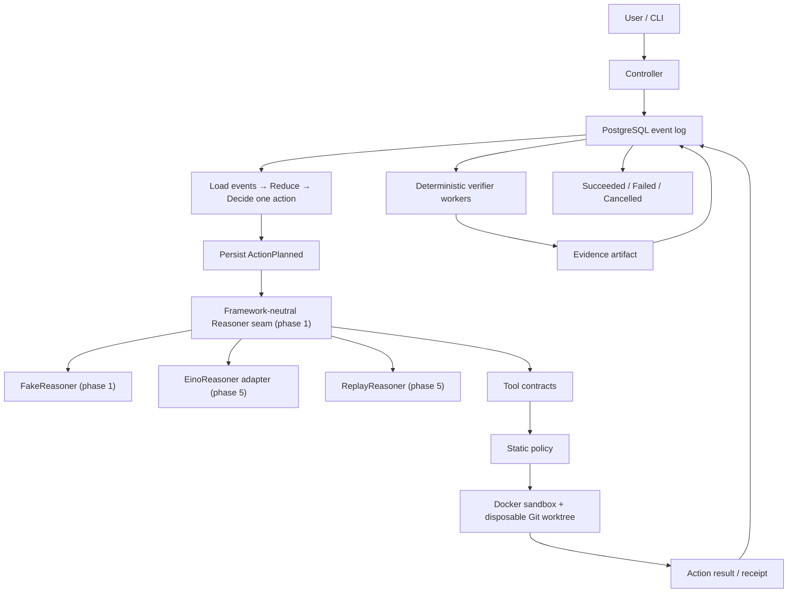

# Architecture

## Position and boundary

AgentDock Verify is a managed runtime around an Eino coding agent. Its workflow stays deliberately small:

```text
Prepare → Reason → Act → Verify → Repair → Verify → Complete
```

The project differentiates itself through durable state, crash recovery, concurrency control, isolated execution, deterministic verification, replay, and evidence—not through a general workflow engine.

This contract was frozen in phase 0. Phase 4 retains the domain reducer/decider, framework-neutral Reasoner seam and FakeReasoner, compatible memory and PostgreSQL Event Stores, transactional Run-version CAS, verified checkpoints, Worker registration, leases, heartbeat, fencing, durable Action Receipts, crash takeover, and Worker CLI. It now implements the Tool Contract/static Policy seam and disposable Docker worktree execution. Eino, verifier/repair, replay products, and telemetry remain assigned to later phases.

## Request-to-artifact path



The end-to-end path is:

1. The CLI submits a `HarnessRun` request.
2. The controller appends `RunCreated`; it does not make an in-memory object authoritative.
3. A worker acquires a lease and a monotonically increasing fencing token.
4. Reconcile loads events, reduces state, and decides at most one action.
5. The worker appends `ActionPlanned` with a stable `action_id` before an external action.
6. In phase 1, `FakeReasoner` returns the minimum framework-neutral result needed to complete a deterministic Run, including the minimal internal tool-call variant required by Gate 1's invalid-tool-call test. From phase 5, `EinoReasoner` and `ReplayReasoner` normalize provider/recorded streaming, tool-call, usage, finish, and error data into that internal contract; Eino-specific types stay inside the Eino adapter.
7. A declared phase-4 tool is checked against its input JSON Schema, capability/path/network/budget policy, and environment allowlist; the sandbox then executes only the fixed helper surface in a disposable Docker worktree.
8. The result and receipt are persisted, and any patch is complete and digest-addressed when its Artifact metadata is registered.
9. Deterministic verifiers bind evidence to `run_id`, `attempt_id`, `workspace_digest`, `spec_hash`, and verifier version.
10. Only verifier evidence permits the controller to append a terminal success event.

## Component ownership

| Component | Owns | Does not own |
|---|---|---|
| CLI | user commands and rendering | workflow truth |
| Controller | desired/observed lifecycle and reconcile decisions | model-internal state |
| PostgreSQL store | ordered events, transactional run version/fencing checks, attempts, checkpoint cache, artifact metadata | artifact bytes or deciding action safety |
| Worker | leased action execution | permanent authority |
| Reasoner seam | framework-neutral request/result contract used by Controller | Eino/provider types and run lifecycle |
| FakeReasoner | deterministic phase 1 reasoning for the pure state-machine demo | live models, Eino, streaming, replay |
| EinoReasoner adapter | phase 5 ChatModel, message, tool-call, streaming, usage, and error adaptation | leases, persistence, policy, verification |
| ReplayReasoner | phase 5 deterministic playback of normalized recorded reasoner results | live model calls and event-log replay |
| Tool/policy layer | five versioned contracts, input/output schemas, capabilities, paths, network, time/output budgets, and audit | arbitrary host shell or deciding Run success |
| Sandbox | one Run/Attempt worktree, immutable image ID, constrained Docker process execution, output capture, and cleanup | strong tenant isolation or phase-3 lifecycle authority |
| Verifier | deterministic pass/fail evidence | accepting an agent's self-report |
| Artifact store | complete-at-registration evidence bytes, stable idempotent identity, and digest metadata | deciding success or preventing later file/metadata mutation |
| Replay | state reconstruction and recorded dependency playback | silently ignoring divergence |

## Eino boundary

Phase 1 defines the minimum internal, framework-neutral `Reasoner` seam and implements `FakeReasoner`. This is required to drive one Run through the pure state machine without PostgreSQL, Docker, Eino, model credentials, streaming, or provider-specific concepts. The phase 1 result includes only the minimal internal tool-call representation needed to accept a valid fake result and turn an illegal fake tool call into a controlled failure; it does not implement the phase 4 Tool Contract or tool execution. Controller depends only on this internal seam.

Phase 5 implements `EinoReasoner` and `ReplayReasoner`, plus normalization of streaming chunks, Eino/recorded tool calls, usage, finish, and provider errors into the internal result model. If those needs require evolving the phase 1 seam, changes must be additive or otherwise backward-compatible for the Controller and `FakeReasoner`; the seam is not replaced with an Eino interface.

Eino supplies model and agent components: ChatModel, messages, tool calls, streaming, and adapter-level events. The controller must not import Eino agent state or concrete Eino types. Eino cannot write the event store, access the host filesystem, acquire leases, approve policy, create verification results, or decide a terminal Run state.

## Durable reconciliation

Every cycle follows one path:

```text
Load events
→ Reduce state
→ Decide at most one action
→ Persist intent
→ Execute the action
→ Persist result
→ Renew or release lease
```

Phase 3 runs this same path after a clean start, process restart, or lease takeover. PostgreSQL events and Action Receipts are the recovery inputs; Run columns and checkpoints are reproducible caches, and a corrupt checkpoint falls back to full-log reduction. Process memory is a cache only.

## Leases and fencing

Each process incarnation registers a unique, non-reusable Worker ID in
PostgreSQL and updates a process heartbeat from an independent ticker, including
while Lease acquisition is waiting or polling slowly. Duplicate registration is
rejected so two live processes cannot share one lease identity/token. A Run has
at most one Lease row. Initial acquisition receives token 1; a takeover is
permitted only after database-time expiry and increments the previous token
under a row lock. Renewal extends expiry without changing the token. Lease
checks and expiry writes use PostgreSQL `clock_timestamp()` after lock waits;
transaction-start time is never treated as post-wait authority.

A lease grants temporary scheduling ownership; it cannot revoke a paused,
killed, or partitioned process. The first durable Lease row permanently marks
the Run as managed. PostgreSQL serializes that mode decision with Lease
acquisition using the same per-Run advisory lock. A managed Run rejects the
unleased compatibility `Reconcile` path and all legacy lifecycle execution
events; generic action Events and Receipts must present the Worker ID and token.
PostgreSQL checks the current owner, exact token, and unexpired TTL in the same
transaction before idempotency replay. Reducer validation separately rejects a
legacy result while a generic action is pending. A stale or identity-less
writer therefore cannot turn an old duplicate or legacy event into apparent
progress. `RunDesiredStateChanged` remains an explicit operator write, so
Pause/Resume/Cancel intent does not require a Worker Lease.

The compatibility path has two plan/result pairs (`ReasoningPlanned` and
`VerificationPlanned`). Initial Lease acquisition inspects them under the same
advisory lock. If a plan is unresolved, acquisition returns a retryable held
result and creates no Lease/token. Once the compatibility result commits, the
next acquisition creates token 1. Thus acquisition cannot split one
plan→execute→result operation across the legacy and managed event models.

## Crash windows

| Crash point | Durable observation | Recovery decision |
|---|---|---|
| Before `ActionPlanned` | no intent exists | decide the action normally |
| After planned, before execution | intent exists, no receipt | retry only if the scoped action is idempotent |
| During execution | intent exists, completion uncertain | inspect Receipt/Artifact; retry if scoped-safe, otherwise request approval |
| After execution, before completed event | side effect or receipt may exist | reconcile by stable `action_id`; never assume absence |
| After completed event | completion is durable | reduce and advance; do not execute again |

Phase 3 uses only Event/Receipt appends and one deterministic receipt Artifact.
Receipt persistence rejects action-specific output that cannot be reduced.
The Receipt stores independent canonical inline-output and Artifact-byte
digests. ApplyPatch evidence is bound to the stable action ID, Run, planned
Attempt, phase-3 Artifact type, and digest. Before a Receipt completes recovery,
its output is dry-reduced and referenced Artifact metadata/bytes are re-hashed;
the PostgreSQL Event Store repeats the byte check inside direct
`ActionCompleted` append validation so bypassing Controller cannot bless
changed evidence. Malformed or changed evidence enters `WaitingApproval`.
Phase 4 adds disposable worktrees and containers without changing this
recovery interpretation. The Tool Service is an execution dependency behind a
phase-3 `ActionExecutor`; it does not receive Event Store, Lease, or terminal
state authority. Phase 5 may translate normalized Reasoner tool calls into
this service, but phase 4 does not add that adapter. Actions outside the frozen
MVP side-effect set are out of scope.

## Phase 4 execution boundary

One `Sandbox` is bound to one `run_id` and `attempt_id`. Provisioning uses
`git worktree add --no-checkout --detach` below a private canonical temporary
root. A scrubbed, non-interactive host Git process materializes the resolved
commit with fixed `ls-tree`/`cat-file` operations; hooks, fsmonitor, replacement
objects, lazy fetch, protocol-from-user, and checkout filters are disabled.
Docker mounts only that worktree at `/workspace`; the source checkout is never
mounted. Before mount, the linked-worktree `.git` pointer is replaced by a
fixed non-host path and over-mounted read-only. This protects the pointer while
the private worktree root remains non-sticky so UID 65532 can atomically
replace top-level files. The pointer is restored only for bounded Destroy. The
configured image tag is resolved to an immutable local SHA-256 image ID before
execution. The worktree Provider records the canonical temporary path before
directory removal or `git worktree add`; the Docker Provider records its full
random owner token and cleanup handle before container side effects. If
provisioning rollback fails, `Create` returns both the error and a non-nil
Sandbox cleanup handle. The Git Provider can retry retained standalone
worktree handles; the Docker Provider retries each retained Sandbox, which
keeps its worktree until the owned container set has converged. This also works
if the immediate caller lost the returned handle.

Every container uses:

- a fixed numeric unprivileged UID/GID (`65532:65532`), with write bits added
  only inside the disposable worktree;
- `--read-only`, `--network none`, `--cap-drop ALL`, and
  `no-new-privileges`;
- CPU, memory, and PID cgroup limits;
- a bounded command context followed by explicit container kill/remove;
- one combined stdout-plus-stderr cap;
- a fixed Go environment (`GOENV=off`, empty `GOFLAGS`) plus a production
  caller-environment allowlist that is empty by default;
- `--ipc none` and no caller-writable tmpfs; Go home, cache, and temp
  directories live under `/workspace/.agentdock`.

Each Sandbox has a cryptographically random owner token. Docker names include
only a token prefix, while the full token, Run ID, Attempt ID, and phase are
labels. Create, start, timeout kill, normal remove, failure cleanup, and
Destroy resolve an immutable container ID and require all ownership labels to
match before acting. A name collision or forged/mismatched label is rejected
and never cleaned as if it belonged to the current Sandbox.
An unresolved name after a transient inspect failure remains tracked for a
bounded re-inspection and later Destroy retry. Docker create uses an independent
bounded context because caller cancellation does not prove the daemon-side
result. Destroy also scans by the full owner token, then re-validates phase,
Run, Attempt, and immutable container ID before removal; this recovers an owned
late-visible container without touching a forged-scope or other-Provider
container. Command completion is not audited as successful until
owned-container removal succeeds, and cleanup failure is explicitly audited
on success, non-zero exit, timeout, and cancellation paths. Destroy is a
one-way state transition: Execute is denied once cleanup starts. If worktree
removal fails after the real `.git` pointer is restored, the pointer is
re-sanitized before the retryable failure is returned.

The container command allowlist contains only `agentdock-sandbox-helper`.
That helper provides list/read/search/exact-replacement/test plus internal
security probes; external Tool callers can reach only the five registered Tool
Contracts. `repo.test` constructs `go test` arguments from repository-relative
package paths and does not accept `-exec`, `-toolexec`, output paths, or a
shell string.
Exact replacement requires the replacement text not to retain the old text,
so replay after a successful patch is rejected as declared by the Contract.

Path safety is two-layered. The host rejects absolute paths, lexical `..`, and
existing symlink escape before policy evaluation; `.git` and `.agentdock` are
reserved case-insensitively. Immediately before file I/O
inside Docker, the helper opens `/workspace` with Go `os.Root`; its
descriptor-relative methods prevent absolute/traversing symlinks and avoid the
check-then-open race on supported Unix platforms. The security suite races a
workspace symlink between an in-root file and `/etc/passwd` and requires that
only the in-root bytes or a rejection can be observed.

The Tool Service checks that every Invocation Run/Attempt exactly matches the
Sandbox-bound scope before policy or execution. Policy audit records contract
and policy versions, effective path/network/time/output decisions, and
environment key names. Sandbox audit records the immutable image ID,
CPU/memory/PID limits, effective timeout/output budget, exit state, timeout,
cancellation, truncation, and cleanup. Values and command output are never
copied into the JSONL audit artifact, and that artifact is not Verifier
evidence.

## Execution semantics

The MVP promises:

```text
at-least-once execution
+ idempotent scoped action
+ fencing token
= effectively-once outcome for those scoped actions
```

It does not promise exactly-once because a crash can occur between an external side effect and its completion event, and Docker/Git/filesystems do not participate in the PostgreSQL transaction.

## Replay definitions

- **Event Replay** reduces the persisted event sequence to rebuild runtime state. It does not re-run a model or tool.
- **Execution Replay** feeds recorded model/tool cassettes through the execution path to reproduce normalized decisions and evidence without live dependencies.

Execution Replay must report divergence when normalized output, workspace digest, spec hash, or verifier evidence differs. It must not rewrite historical events to hide the difference.

## Technology shape

The MVP is one Go repository with PostgreSQL, one controller, multiple workers, Docker Compose for local services, an OpenTelemetry Collector, and Jaeger. It has no Kafka, Redis, Temporal, external queue, Kubernetes, or service mesh. PostgreSQL provides both the authoritative log and worker coordination primitives needed at this scale.

## MVP versus extension

MVP components are the fixed list in [`scope.md`](scope.md). Multi-tenancy, credential brokering, Kubernetes scheduling, MCP integration, extra model providers, UI, generalized workflows, and stronger sandbox technologies are extensions. They require new threat models and ADRs rather than hooks added pre-emptively to phase 0.

## Highest risks

1. **Recovery correctness:** ambiguous crash windows can duplicate or lose effects unless intent, receipts, idempotency, and fencing agree.
2. **Docker isolation boundary:** container controls reduce risk but do not isolate a hostile tenant from the host kernel.
3. **Replay consistency:** non-deterministic model/tool output, mutable images, changing verifier versions, or missing digests can make a replay misleading.
