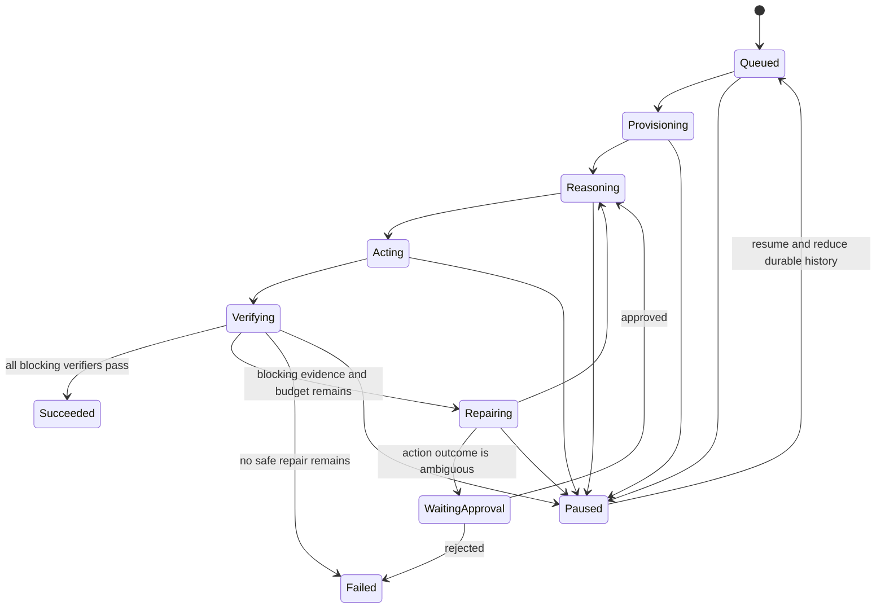

# Run state machine

This contract was frozen in phase 0. Phase 1 implements its active success, Pause/Resume, Cancel, and controlled-failure subset in `internal/domain` and `internal/controller`; repair and approval transitions remain assigned to later phases.

## State dimensions

`desired_state` records operator intent (`Running`, `Paused`, or `Cancelled`). `observed_state` records the runtime's reduced state:

```text
Queued
Provisioning
Reasoning
Acting
Verifying
Repairing
WaitingApproval
Paused
Succeeded
Failed
Cancelled
```

Only `Succeeded`, `Failed`, and `Cancelled` are terminal.

## Nominal flow



Cancellation can move any non-terminal state to `Cancelled`. A terminal state has no outgoing transitions.

## Transition ownership

Models and tools emit normalized results; they do not write a state. State is derived by a pure reducer over the ordered event log. The controller decides a command from reduced state, desired state, budgets, and durable receipts. Only controller/store rules can accept a transition.

## Pause, resume, and cancel

- Pause changes desired state and prevents Reconcile from planning a new external action.
- Pause does not erase a durable planned action. Its matching completion or failure result remains auditable even if Pause wins the race before the result append.
- Resume does not jump to a hard-coded state. It reloads events and resumes the same reconciliation path.
- Cancel persists intent first, stops planning work, attempts bounded cleanup, and converges to `Cancelled`.

### Phase 1 planned-result concurrency

Phase 1 distinguishes starting work from recording the result of work that already has a matching `action_id`:

- `ReasoningPlanned` and `VerificationPlanned` are rejected after Pause, so Pause prevents new work.
- A matching `ReasoningCompleted`, `ToolCallFailed`, or `VerificationPassed` is accepted after Pause because the work was already planned.
- `ReasoningCompleted` advances the saved resume target from `Reasoning` to `Acting`; `VerificationPassed` records evidence while keeping the resume target at `Verifying`; `ToolCallFailed` records the durable failure prefix.
- While desired state remains Paused, `Decide` returns `Noop` even after one of those results.
- Resume continues with `ApplyPatch`, `SucceedRun`, or `FailRun` as derived from the persisted result. It does not execute the completed Reasoner or verification action again.
- `ToolCallFailed` and `RunFailed` are separate appends. If execution stops after the first, the next active Reconcile deterministically emits stable `FailRun` and converges to `RunFailed`.

These are single-process logical concurrency semantics. Phase 1 has no process crash recovery, CAS, lease, or fencing; those remain assigned to phases 2 and 3.

## Repair and approval

Repair is bounded to three rounds. A verifier failure with remaining budget schedules repair. Repeated identical patches, exhausted rounds, or an unsafe/ambiguous side effect lead to `Failed` or `WaitingApproval`; they never produce success.

## Required invariants

- Event sequence and Run version are monotonic.
- One Reconcile decision produces at most one external action.
- Every external action has a stable `action_id` and a durable planned event.
- A stale fencing token cannot append a lease-sensitive event.
- Success requires current blocking verifier evidence for the current workspace/spec/verifier versions.
- Pause emits no new side-effect command.
- Terminal states cannot advance.
- Replaying the same valid event sequence produces byte-for-byte equivalent state fields.
- Time, randomness, network, and process memory are not reducer inputs.

Phase 1 makes the reducer/decider, transition ownership, deterministic replay, Pause/Resume/Cancel, stable action ID, terminal-state, malformed-event, and in-memory idempotency invariants executable. Lease/fencing, current verifier evidence, recovery, repair, and approval invariants remain assigned to their planned later phases.
