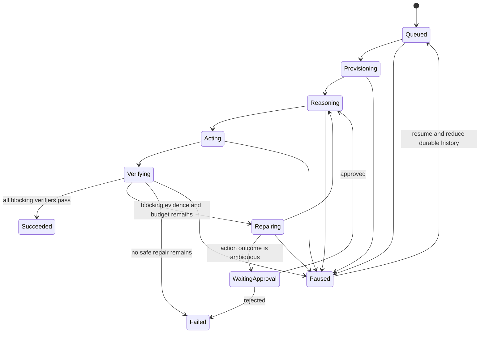

# Run state machine

This phase 0 document freezes state names, ownership, transitions, and invariants. It does not implement the reducer or controller.

## State dimensions

`desired_state` records operator intent (`Running`, `Paused`, or `Cancelled`). `observed_state` records the runtime's reduced state:

```text
Queued
Provisioning
Reasoning
Acting
Verifying
Repairing
WaitingApproval
Paused
Succeeded
Failed
Cancelled
```

Only `Succeeded`, `Failed`, and `Cancelled` are terminal.

## Nominal flow



Cancellation can move any non-terminal state to `Cancelled`. A terminal state has no outgoing transitions.

## Transition ownership

Models and tools emit normalized results; they do not write a state. State is derived by a pure reducer over the ordered event log. The controller decides a command from reduced state, desired state, budgets, and durable receipts. Only controller/store rules can accept a transition.

## Pause, resume, and cancel

- Pause changes desired state and prevents Reconcile from planning a new external action.
- An already-running action is cancelled when its contract permits cancellation; its eventual result remains auditable.
- Resume does not jump to a hard-coded state. It reloads events and resumes the same reconciliation path.
- Cancel persists intent first, stops planning work, attempts bounded cleanup, and converges to `Cancelled`.

## Repair and approval

Repair is bounded to three rounds. A verifier failure with remaining budget schedules repair. Repeated identical patches, exhausted rounds, or an unsafe/ambiguous side effect lead to `Failed` or `WaitingApproval`; they never produce success.

## Required invariants

- Event sequence and Run version are monotonic.
- One Reconcile decision produces at most one external action.
- Every external action has a stable `action_id` and a durable planned event.
- A stale fencing token cannot append a lease-sensitive event.
- Success requires current blocking verifier evidence for the current workspace/spec/verifier versions.
- Pause emits no new side-effect command.
- Terminal states cannot advance.
- Replaying the same valid event sequence produces byte-for-byte equivalent state fields.
- Time, randomness, network, and process memory are not reducer inputs.

These invariants become executable acceptance tests in later phases; they are not claimed as implemented in phase 0.
