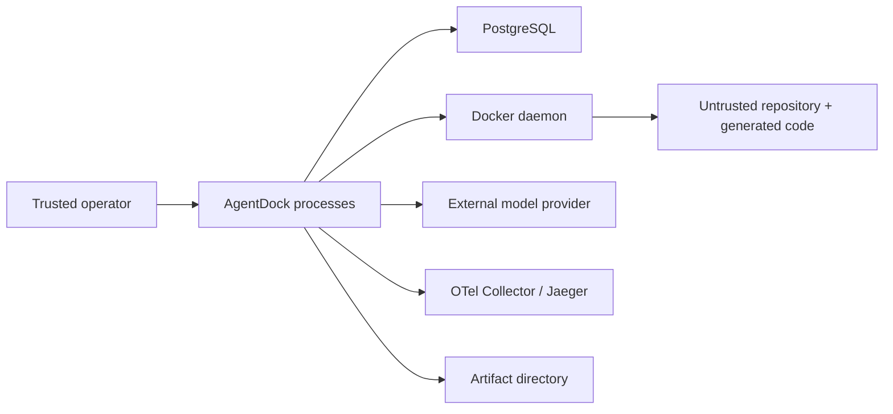

# Threat model

## Scope and current status

This threat model covers the five-week local MVP through phase 5. Controls assigned to later phases remain described as planned.

The MVP is not a multi-tenant service and must not be presented as one.

## Assets

- source repository and its Git history;
- disposable worktree contents;
- patches and verifier evidence;
- event log integrity and ordering;
- lease and fencing state;
- artifact and cassette confidentiality/integrity;
- model credentials supplied outside the repository;
- database credentials supplied outside committed files;
- host filesystem, Docker daemon, kernel, CPU, memory, disk, and network;
- trace and audit data.

## Trust boundaries

The model output, target repository, generated patch, tool arguments, and sandbox process are untrusted. PostgreSQL, artifact storage, the Docker daemon, and the host are trusted infrastructure for the local MVP.

## Principal threats and planned controls

| Threat | Planned control | Residual risk |
|---|---|---|
| Prompt/tool injection | **Implemented through phase 5:** fixed System Contract, five Tool Contracts, output normalization, Tool name/input Schema rejection, and phase-4 policy | semantic manipulation within allowed operations |
| Path traversal | **Implemented in phase 4:** lexical normalization, allowlists, host symlink checks, container-side `os.Root` I/O | filesystem/kernel implementation flaws |
| Host modification | **Implemented in phase 4:** no-checkout worktree, hook/filter-free fixed Git materialization, sanitized worktree pointer, source checkout not mounted, no host-shell tool | trusted host Git and Docker daemon still read repository objects and manage the bind mount |
| Network exfiltration | **Implemented in phase 4:** `network=none`; no network-enabled Tool Contract | host-side future model call still leaves the machine |
| Credential leakage | **Implemented through phase 5:** phase-4 execution controls plus no-credential Fake/Replay, credential-marker rejection in cassettes, sanitized provider errors, and external-only live configuration | image/operator/provider misconfiguration or sensitive prompt/repository text |
| Container breakout | **Implemented in phase 4:** non-root, read-only root, dropped capabilities, no-new-privileges, bounded resources | shared kernel means breakout cannot be ruled out |
| Denial of service | **Implemented in phase 4:** CPU/memory/PID/time/output limits plus kill/remove and worktree cleanup | disk pressure or Docker daemon impact |
| Stale or identity-less execution writes | **Implemented in phase 3:** durable Lease-row mode, PostgreSQL owner/token/expiry checks, legacy-event rejection, and reducer mixed-path defense | non-database side effect must still be scoped-idempotent/receipted |
| Forged verifier success | verifier identity/role and digest-bound evidence | compromised verifier worker or store |
| Replay disclosure | **Partially implemented in phase 5:** normalized cassette schema and credential-marker scanning; no raw provider payloads | prompts or repository text may still be sensitive; strong immutable storage is later work |
| Replay false equivalence | pinned versions/digests and explicit divergence | unavoidable external or platform nondeterminism |
| Event tampering | transactional append, uniqueness, audit metadata | trusted database administrator can alter data |

## Docker security boundary

Docker is selected because coding-agent workloads need native Go tooling, Git, tests, and process execution. wazero is well suited to pure WebAssembly tools but cannot by itself run the required repository workload without a parallel execution system.

Docker is not a strong security boundary:

- containers share the host kernel;
- the Docker daemon is highly privileged;
- bind mounts can expose host paths if configured incorrectly;
- resource controls do not eliminate kernel or daemon denial of service;
- local developer machines often contain valuable credentials.

The MVP must use a disposable worktree, minimal mounts, non-root user, read-only root filesystem, dropped capabilities, default-denied network, and bounded resources. Even with those controls, hostile third-party code should run on a disposable dedicated runner, not a sensitive workstation.

## Secrets

Committed files contain only documented local example values. Real model keys and production database credentials must enter through an external secret mechanism or untracked `.env`, must be allowlisted per process, and must never be stored in events, artifacts, cassettes, traces, screenshots, or status reports.

## Highest risks

1. Recovery correctness across ambiguous action windows.
2. The limits of Docker as an isolation boundary.
3. Replay consistency and the risk of leaking recorded data.

Each later phase must update this document with implemented controls and test evidence. A planned control is not evidence that the risk is mitigated.

## Phase 3 recovery controls

- Worker registration and heartbeat are durable PostgreSQL rows; process
  heartbeat runs independently of Lease polling and renewal.
- Lease acquisition/takeover is serialized per Run; takeover increments the
  fencing token.
- Managed Event and Receipt transactions reject stale or expired authority
  before idempotency replay, using wall-clock time after lock waits.
- A durable Lease row permanently selects managed execution. The Store rejects
  unleased or legacy lifecycle execution events for that Run, while explicit
  operator desired-state changes remain available.
- Unknown unsafe outcomes stop in `WaitingApproval`.
- Malformed Receipt output or changed Artifact bytes cannot complete a Run;
  recovery dry-reduces and re-hashes the evidence, then stops in
  `WaitingApproval`.
- The 100-iteration Worker Kill harness uses real OS processes and verifies
  terminal convergence plus unique Receipt/Artifact accounting.

These controls do not prevent a stale process from consuming CPU or performing
a non-database side effect. Safety still depends on the action's scoped
idempotency and durable Receipt/Artifact evidence.

## Phase 4 sandbox and Tool controls

- The source checkout is used only as the Git worktree owner and object source.
  Each Run/Attempt gets a private detached `--no-checkout` worktree. Fixed
  `ls-tree`/`cat-file` materialization disables hooks, checkout filters,
  fsmonitor, replacement objects, lazy fetch, interactive protocol use, and
  inherited host credentials. Docker mounts only that directory, with its
  absolute `.git` pointer replaced by a fixed non-host path and over-mounted
  read-only. The private parent root protects the non-sticky disposable
  directory needed for top-level atomic patch replacement.
- Docker resolves the configured sandbox image to a local immutable image ID,
  runs with a numeric non-root user, read-only RootFS, no network, no
  capabilities, `no-new-privileges`, and CPU/memory/PID limits.
- The only caller-visible Tool Contracts are `repo.list`, `repo.read`,
  `repo.search`, `repo.apply_patch`, and `repo.test`. No Tool accepts a host
  executable or shell string.
- Host path normalization rejects absolute paths and `..` before policy. The
  container helper repeats access through `os.Root`; the negative suite covers
  absolute paths, traversal, fixed symlink escape, and a concurrent symlink
  replacement probe.
- The committed caller-environment allowlist is empty. Go control variables
  are fixed (`GOENV=off`, empty `GOFLAGS`) and cannot be overridden. Audit
  events contain key names, contract/policy versions, decisions, effective
  limits, immutable image ID, exit state, and counts, never values or command
  output.
- Allow, deny, completion/failure, timeout, truncation, and Destroy facts are
  written to the phase-4 JSONL audit artifact. They are operational evidence,
  not `VerificationPassed` or any phase-6 Verifier result.
- A cryptographic per-Sandbox owner token plus exact phase/Run/Attempt labels
  gates create/start/kill/remove/failure cleanup/Destroy; operations use the
  immutable container ID after creation. Foreign name collisions and forged
  or scope-mismatched labels are never removed. Timeout/cancellation kills and
  removes the owned container. Destroy is retryable, audits both failure and
  success, fixes permissions with an owned cleanup container, disables further
  Execute calls as soon as cleanup starts, and removes the temporary worktree
  without global `git worktree prune`. A failed worktree removal restores the
  sanitized `.git` pointer before returning. Pending ownership is recorded
  before worktree/container side effects; failed provisioning rollback returns
  a cleanup handle and remains visible to Provider `Cleanup`. An
  outcome-unknown Docker create stays tracked through bounded re-inspection and
  every later empty snapshot. Time passage, name `not found`, and an empty
  owner-token scan do not prove absence; Destroy returns and audits an explicit
  retryable failure while retaining owner/pending/worktree state. Destroy scans
  by full owner token but re-validates exact phase/Run/Attempt labels before any
  fallback removal. Docker Provider cleanup retains the worktree while any
  owned container outcome remains unresolved. Acceptance compares the source
  repository digest and Git status before and after.

Residual risks remain: Docker Desktop/daemon and the shared kernel are trusted;
disk exhaustion is not completely bounded; repositories without vendored or
image-preloaded modules can fail `go test` because network is deliberately
disabled; and a malicious kernel or daemon can defeat these controls.

## Phase 5 Reasoner and recorded-agent controls

- `reasoner.Request` has exactly five fields: Messages, Tool Contracts, task
  summary, failure evidence, and Budget. Runtime Run/Attempt scope is outside
  the model input.
- Normalized output has only Text Delta, Tool Call, Usage, Finish, and Error.
  Unknown Tools and arguments outside the registered input Schema become
  terminal non-retryable errors before Tool invocation.
- The fixed System Contract is the only system-authority message accepted by
  the adapter. Task summary and failure evidence are escaped into delimited
  JSON and presented as lower-authority user data.
- Streaming interruption becomes a retryable normalized error. Provider
  authentication, rate-limit, invalid-request, timeout/unavailable, and
  cancellation classes use stable messages rather than copying raw errors.
- Every successful phase-5 turn requires exactly one Usage event before
  Finish. Missing/duplicate Usage, decreasing Eino counters, or token usage
  beyond the current budget closes the source stream and emits a terminal
  error. The Coding Agent also enforces the cumulative budget across turns.
- Eino imports are confined to `internal/reasoner/eino`. Reasoner production
  packages have no direct database, Store, Sandbox, process, or host-filesystem
  imports. Registry contracts are immutable snapshots, and Coding Agent checks
  the complete Reasoner/Service contract set (including Schemas, paths, network,
  time/output limits, capability, and idempotency) before Reasoner runs. Every
  Coding Agent Tool call is then passed to that existing Tool Service.
- Fake and Replay require no credential. Committed normalized cassettes carry
  explicit recorded/redacted metadata, pass event-order and terminal-state
  validation, and are scanned before and after JSON decoding for common
  credential shapes; the recorded demo repairs two fixed scenarios only in
  disposable Docker worktrees. These scans reduce accidental disclosure but
  do not replace operator review or a dedicated secret scanner.

This phase does not implement phase-6 verifier authority, repair, or evidence,
and does not implement phase-7 Event Replay, divergence evidence, OTel, or
fault injection. A live model still sends selected prompt/repository context to
its externally configured provider and must be used only with an operator-
approved data policy.
