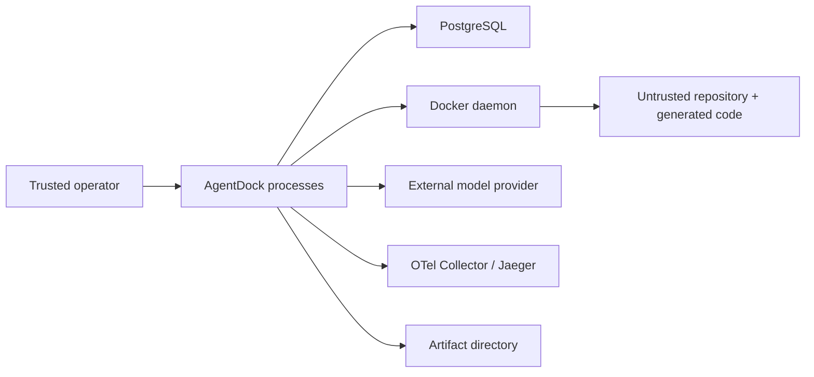

# Threat model

## Scope and current status

This threat model covers the five-week local MVP through phase 3. Runtime controls not yet implemented remain described as planned.

The MVP is not a multi-tenant service and must not be presented as one.

## Assets

- source repository and its Git history;
- disposable worktree contents;
- patches and verifier evidence;
- event log integrity and ordering;
- lease and fencing state;
- artifact and cassette confidentiality/integrity;
- model credentials supplied outside the repository;
- database credentials supplied outside committed files;
- host filesystem, Docker daemon, kernel, CPU, memory, disk, and network;
- trace and audit data.

## Trust boundaries

The model output, target repository, generated patch, tool arguments, and sandbox process are untrusted. PostgreSQL, artifact storage, the Docker daemon, and the host are trusted infrastructure for the local MVP.

## Principal threats and planned controls

| Threat | Planned control | Residual risk |
|---|---|---|
| Prompt/tool injection | fixed tool contracts, JSON schemas, capability and path policy | semantic manipulation within allowed operations |
| Path traversal | canonical paths, allowlists, symlink escape checks | filesystem/kernel implementation flaws |
| Host modification | disposable Git worktree, no arbitrary host shell | Docker daemon and bind-mount configuration remain privileged |
| Network exfiltration | `network=none` by default, explicit egress policy later | host-side model call still leaves the machine |
| Credential leakage | environment allowlist, redaction, no secrets in events/traces/cassettes | provider or operator misconfiguration |
| Container breakout | non-root user, read-only root, dropped capabilities, resource limits | shared kernel means breakout cannot be ruled out |
| Denial of service | CPU/memory/PID/time/output limits and cleanup | disk pressure or Docker daemon impact |
| Stale worker writes | **Implemented in phase 3:** PostgreSQL owner/token/expiry checks for managed Events and Receipts | non-database side effect must still be scoped-idempotent/receipted |
| Forged verifier success | verifier identity/role and digest-bound evidence | compromised verifier worker or store |
| Replay disclosure | redacted immutable cassettes, credential scanning | prompts or repository text may still be sensitive |
| Replay false equivalence | pinned versions/digests and explicit divergence | unavoidable external or platform nondeterminism |
| Event tampering | transactional append, uniqueness, audit metadata | trusted database administrator can alter data |

## Docker security boundary

Docker is selected because coding-agent workloads need native Go tooling, Git, tests, and process execution. wazero is well suited to pure WebAssembly tools but cannot by itself run the required repository workload without a parallel execution system.

Docker is not a strong security boundary:

- containers share the host kernel;
- the Docker daemon is highly privileged;
- bind mounts can expose host paths if configured incorrectly;
- resource controls do not eliminate kernel or daemon denial of service;
- local developer machines often contain valuable credentials.

The MVP must use a disposable worktree, minimal mounts, non-root user, read-only root filesystem, dropped capabilities, default-denied network, and bounded resources. Even with those controls, hostile third-party code should run on a disposable dedicated runner, not a sensitive workstation.

## Secrets

Committed files contain only documented local example values. Real model keys and production database credentials must enter through an external secret mechanism or untracked `.env`, must be allowlisted per process, and must never be stored in events, artifacts, cassettes, traces, screenshots, or status reports.

## Highest risks

1. Recovery correctness across ambiguous action windows.
2. The limits of Docker as an isolation boundary.
3. Replay consistency and the risk of leaking recorded data.

Each later phase must update this document with implemented controls and test evidence. A planned control is not evidence that the risk is mitigated.

## Phase 3 recovery controls

- Worker registration and heartbeat are durable PostgreSQL rows; process
  heartbeat runs independently of Lease polling and renewal.
- Lease acquisition/takeover is serialized per Run; takeover increments the
  fencing token.
- Managed Event and Receipt transactions reject stale or expired authority
  before idempotency replay, using wall-clock time after lock waits.
- Unknown unsafe outcomes stop in `WaitingApproval`.
- Malformed Receipt output or changed Artifact bytes cannot complete a Run;
  recovery dry-reduces and re-hashes the evidence, then stops in
  `WaitingApproval`.
- The 100-iteration Worker Kill harness uses real OS processes and verifies
  terminal convergence plus unique Receipt/Artifact accounting.

These controls do not prevent a stale process from consuming CPU or performing
a non-database side effect. Safety still depends on the action's scoped
idempotency and durable Receipt/Artifact evidence.
